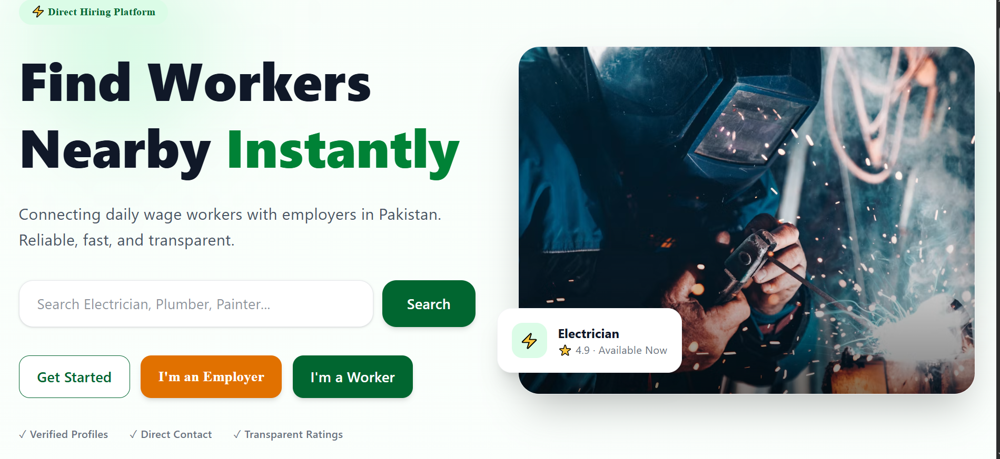
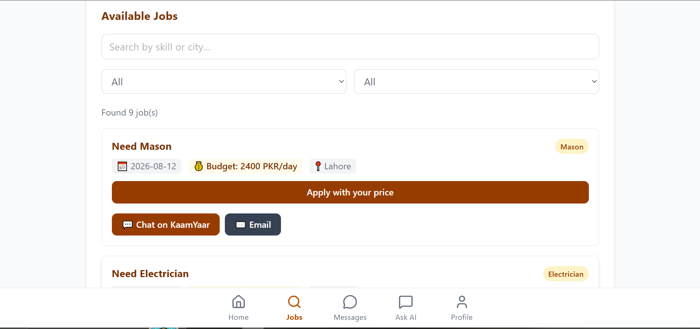
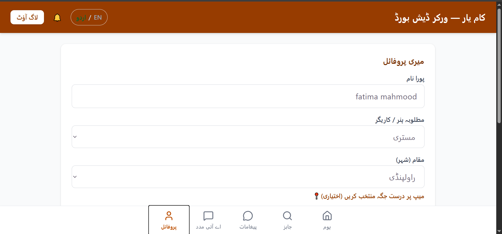
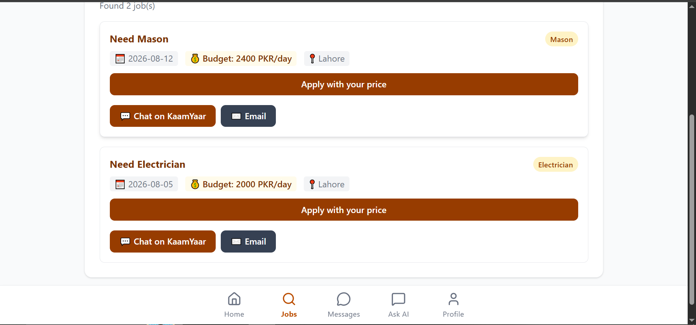

# KaamYaar ⚡

> **Connecting local daily-wage workers and employers across Pakistan.**


---

# 🌐 Live Demo

### 🚀 Try KaamYaar

**Website:** https://kaam-yaar.vercel.app

---
<p align="center">
  
</p>

# 📖 Table of Contents

- App Overview
- Real-World Problem
- Target Audience
- Features
- AI Assistant
- Tech Stack
- Screenshots
- Project Structure
- Installation
- Future Improvements
- Developer
- Support
- License

---

# 📌 App Overview

## App Name

**KaamYaar**

KaamYaar is a modern web-based platform designed to connect **daily-wage workers** directly with **employers** across Pakistan.

The platform helps employers quickly find skilled workers while enabling workers to discover nearby job opportunities without depending on contractors or middlemen.

It provides an easy-to-use interface, real-time communication, AI-powered recommendations, and location-based search to simplify the hiring process for both sides.

---

# 🌍 Real-World Problem

The idea for **KaamYaar** came from a real-life observation.

During my observation, I noticed that many skilled workers in Pakistan—such as electricians, plumbers, painters, carpenters, masons, and laborers—often work temporarily under contractors. Once a project is completed, many of these workers become unemployed and spend days or even weeks searching for their next opportunity.

At the same time, many employers struggle to find reliable skilled workers nearby.

This real-world problem inspired me to develop **KaamYaar**, a platform that enables employers and skilled workers to connect directly without relying on contractors or middlemen, making it easier for workers to find nearby job opportunities and for employers to hire trusted workers quickly.

---

# 🎯 Target Audience

## 👨‍💼 Employers

- Homeowners
- Shop Owners
- Contractors
- Small Businesses
- Companies
- Anyone looking for skilled workers

---

## 👷 Daily-Wage Workers

- Electricians
- Plumbers
- Painters
- Carpenters
- Masons
- Laborers
- Welders
- Tile Fitters
- General Skilled Workers

---

# ✨ Features

## 🔐 Authentication & Security

- Secure Firebase Authentication
- Email & Password Login
- User Registration
- Email Verification
- Forgot Password
- Reset Password
- Protected Routes
- Role-Based Authentication
- Secure User Sessions

---

## 👷 Worker Features

- Create Professional Profile
- Add Personal Information
- Add Skill Category
- Select City
- Set Daily Wage
- Add Experience
- Availability Status
- Browse Available Jobs
- Search Jobs
- Filter Jobs
- Apply for Jobs
- View Job Status
- Receive Notifications
- Chat with Employers
- Edit Profile

---

## 💼 Employer Features

- Post New Jobs
- Edit Posted Jobs
- Delete Jobs
- Manage Job Listings
- Browse Workers
- Search Workers
- Filter by Skill
- Filter by City
- View Worker Profiles
- View Ratings & Reviews
- Compare Applicants
- Hire Workers
- Leave Ratings
- Write Reviews

---

## 💬 Communication Features

- Real-Time Chat
- Chat History
- Delete Conversations
- WhatsApp Integration
- Direct Phone Call Button
- Instant Notifications

---

## 📍 Maps & Location

- Interactive Maps
- City-Based Filtering
- Nearby Worker Search
- Location Selection

---

# 🤖 AI Assistant

KaamYaar includes an intelligent AI Assistant powered by **Google Gemini AI**.

The assistant helps both employers and workers by providing smart recommendations based on skills, location, and job requirements.

### 👨‍💼 Employer Assistance

- Recommend Best Workers
- Match Workers by Skill
- Budget-Based Suggestions
- City-Based Recommendations

### 👷 Worker Assistance

- Recommend Suitable Jobs
- Suggest Better Opportunities
- Improve Job Matching
- Career Guidance

---

# 🧠 AI System Prompt

```text
You are "KaamYaar AI", a helpful assistant for KaamYaar — Pakistan's local skilled worker marketplace.

Your role is to help employers find the most suitable skilled workers based on city, skill, and budget.

You also help workers discover jobs that best match their skills, preferred city, and expected daily wage.

Always provide concise, polite, practical, and helpful responses.

```

---

# 🛠 Tech Stack

## Frontend

* React
* Vite
* React Router
* Tailwind CSS
* Framer Motion
* Lucide React

## Backend

* Firebase Authentication
* Cloud Firestore

## Artificial Intelligence

* Google Gemini API

## Maps

* React Leaflet
* Leaflet

## Deployment

* Vercel

---

# 📸 Screenshots

## 🌟 Hero Banner Preview


---

## 💼 Employer Dashboard


---

## 📝 Posted Jobs


---

## 👷 Worker Dashboard (English & Urdu Support)

<br><br>


---

## 📂 Apply for Jobs


---

## 💬 Real-Time Chat


---

## 🤖 AI Assistant & Recommendations

<br><br>

# 📂 Project Structure

```text
kaamyaar/
├── public/
├── src/
│   ├── assets/
│   │   ├── AI Assistant.png
│   │   ├── AI Assistant 2.png
│   │   ├── ApplyforJobs.png
│   │   ├── Banner.png
│   │   ├── EmployeeDashboard.png
│   │   ├── Employeepprostedjob.png
│   │   ├── Message.png
│   │   ├── Workerdashboard.png
│   │   └── Workerdashboard(URDU).png
│   ├── components/
│   │   ├── ChatModal.jsx
│   │   ├── LanguageToggle.jsx
│   │   └── Navbar.jsx
│   ├── context/
│   │   └── LanguageContext.jsx
│   ├── pages/
│   │   ├── Landing.jsx
│   │   ├── Login.jsx
│   │   ├── Signup.jsx
│   │   └── Dashboard.jsx
│   ├── firebase.js
│   ├── App.jsx
│   ├── index.css
│   └── main.jsx
├── .env
├── package.json
└── vite.config.js

```

---

# ⚙️ Installation & Setup

Apne local machine par project run karne ke liye yeh steps follow karein:

### 1. Clone the Repository

```bash
git clone [https://github.com/Fatima-3015/KaamYaar.git](https://github.com/Fatima-3015/KaamYaar.git)
cd KaamYaar

```

### 2. Install Dependencies

```bash
npm install

```

### 3. Configure Environment Variables

Project ke root folder mein ek `.env` file banayein aur apni Firebase credentials add karein:

```env
VITE_FIREBASE_API_KEY=your_api_key
VITE_FIREBASE_AUTH_DOMAIN=your_auth_domain
VITE_FIREBASE_PROJECT_ID=your_project_id
VITE_FIREBASE_STORAGE_BUCKET=your_storage_bucket
VITE_FIREBASE_MESSAGING_SENDER_ID=your_messaging_sender_id
VITE_FIREBASE_APP_ID=your_app_id

```

### 4. Run Locally

```bash
npm run dev

```

---

# 🚀 Future Improvements

* [ ] **SMS Notifications:** Twilio ya local gateway integration for booking alerts.
* [ ] **Payment Gateway Integration:** Secure digital escrow/wallet payments for daily wages.
* [ ] **Advanced Geolocation Tracking:** Live tracking of workers during active jobs.
* [ ] **Voice Search Support:** Voice queries in Urdu and English for unlettered workers.

---

# 📈 Why KaamYaar?

* **Direct Impact:** Solves actual unemployment and hiring friction in local communities.
* **Bilingual Interface:** Fully supports both English and Urdu to maximize user accessibility.
* **Modern Tech Stack:** Built with lightning-fast React, Vite, and real-time Firebase capabilities.

---

# 👩‍💻 Developer

**Fatima Mahmood**

* **GitHub:** [Fatima-3015](https://www.google.com/search?q=https://github.com/Fatima-3015)

---

# ⭐ Support

Agar aapko yeh project pasand aaye toh please repository ko **⭐ star** dein aur apne circle mein share karein!

---

# 📜 License

This project is open-source and available under the [MIT License](https://www.google.com/search?q=LICENSE).

```

```
