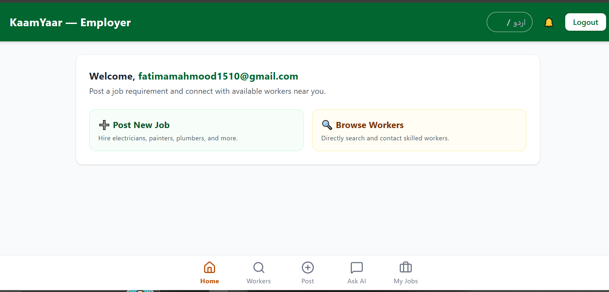
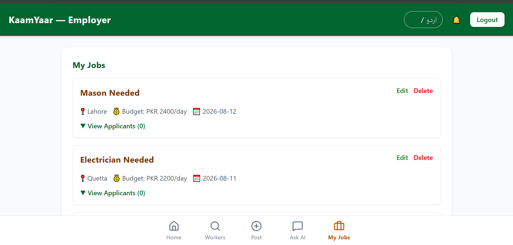
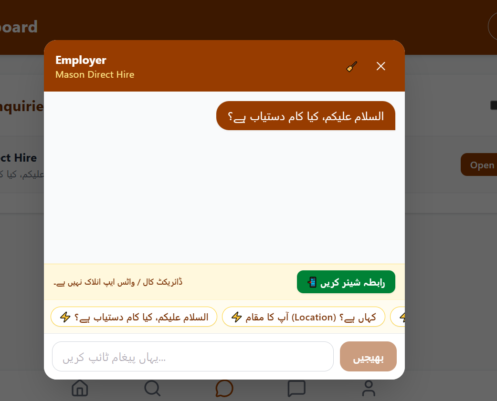
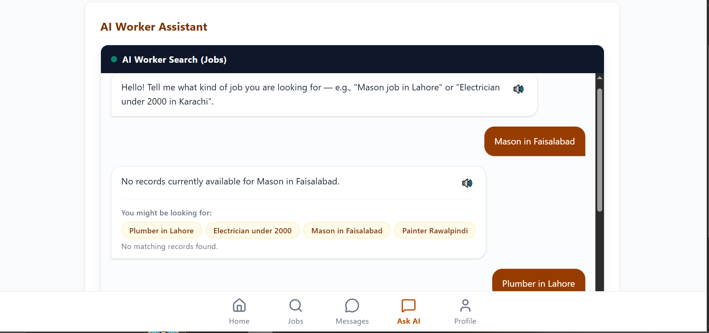
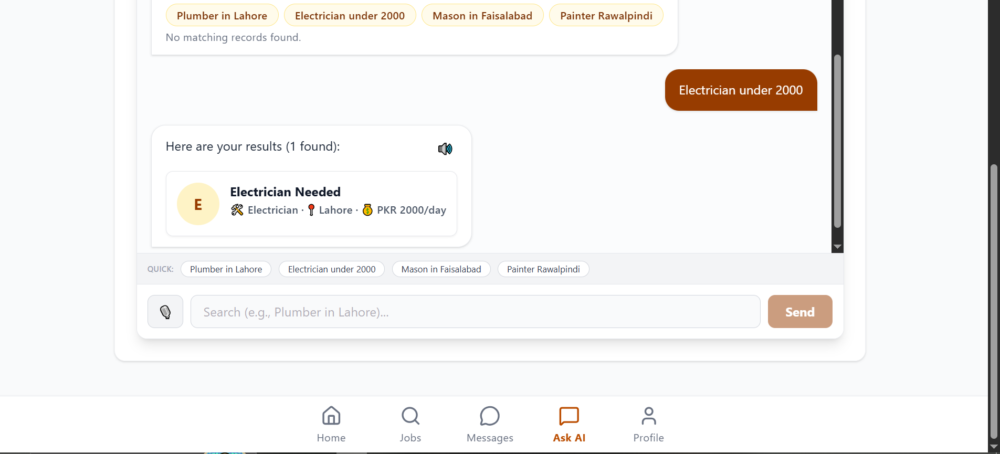

# KaamYaar ⚡

> **Connecting local daily-wage workers and employers across Pakistan.**


---

# 📌 App Overview

## App Name
**KaamYaar**

KaamYaar is a web-based platform that connects **daily-wage workers** directly with **employers** across Pakistan. The platform removes unnecessary middlemen and helps skilled workers quickly find nearby job opportunities while allowing employers to hire trusted workers easily.

---

# 🌍 Real-World Problem

The idea for **KaamYaar** came from a real-life observation.

During my observation, I noticed that many skilled workers in Pakistan, such as electricians, plumbers, painters, carpenters, masons, and laborers, often work temporarily under contractors. Once a project is completed, many of these workers become unemployed and spend days or even weeks searching for their next opportunity. At the same time, many employers struggle to find reliable skilled workers nearby.

This real-world problem inspired me to develop **KaamYaar**, a platform that enables employers and skilled workers to connect directly without relying on contractors or middlemen, making it easier for workers to find nearby job opportunities and for employers to hire trusted workers quickly.

---

# 🎯 Target Audience

## Employers
- Homeowners
- Shop owners
- Contractors
- Small businesses
- Anyone looking for skilled workers

## Daily-Wage Workers
- Electricians
- Plumbers
- Painters
- Carpenters
- Masons
- Laborers
- Other skilled workers

---

# 🔗 Live Demo

### 🌐 Website

https://kaam-yaar.vercel.app

---

# ✨ Features

## 🔐 Authentication

- Firebase Authentication
- Secure Email & Password Login
- Sign Up
- Forgot Password
- Email Verification
- Protected Routes
- Role-Based Authentication

---

## 👷 Worker Features

- Create Professional Profile
- Add Name
- Add Skill
- Add City
- Daily Wage
- Experience
- Phone Number
- Availability Status
- Browse Jobs
- Search Jobs
- Filter Jobs
- Apply for Jobs
- View Application Status
- Real-time Notifications
- Chat with Employers
- Manage Profile

---

## 💼 Employer Features

- Post New Jobs
- Edit Jobs
- Delete Jobs
- Manage Job Listings
- Browse Workers
- Search Workers
- Filter by Skill
- Filter by City
- View Worker Profiles
- View Ratings
- Compare Applicants
- Hire Workers
- Leave Reviews & Ratings

---

## 💬 Communication

- Real-Time Chat
- Chat History
- Delete Conversations
- WhatsApp Integration
- Direct Call Button
- Instant Notifications

---

## 📍 Location Support

- City-Based Filtering
- Interactive Maps
- Nearby Worker Search

---

# 🤖 AI Assistant

KaamYaar includes an intelligent AI assistant powered by **Google Gemini**.

### Employer Assistance

- Recommend best workers
- Match workers by skill
- Budget recommendations
- City-based suggestions

### Worker Assistance

- Recommend matching jobs
- Improve profile suggestions
- Career guidance
- Smart job recommendations

---

# 🧠 AI System Prompt

```text
You are "KaamYaar AI", a helpful assistant for KaamYaar - Pakistan's local skilled worker marketplace.

Your job is to help employers find skilled workers including:
- Electricians
- Plumbers
- Painters
- Masons
- Carpenters
- Laborers

You also help workers discover jobs that match their skills, city, and preferred daily wage.

Always provide short, helpful, polite, and practical responses.
```

---

# 🛠 Tech Stack

## Frontend

- React
- Vite
- React Router
- Tailwind CSS
- Framer Motion
- Lucide React

## Backend

- Firebase Authentication
- Cloud Firestore

## AI

- Google Gemini API

## Maps

- React Leaflet
- Leaflet

## Deployment

- Vercel

---

# 📸 Screenshots

## 💼 Employer Dashboard



---

## 📝 Posted Jobs



---

## 💬 Chat System



---

## 🤖 AI Assistant



---

## ✨ AI Assistant Recommendations


## 💼 Employer Dashboard


---

## 🔎 Browse Jobs


---

## 💬 Chat System


---

## 🤖 AI Assistant


---

# 📂 Project Structure

```text
KaamYaar
│
├── public
├── src
│   ├── components
│   ├── pages
│   ├── context
│   ├── hooks
│   ├── firebase
│   ├── assets
│   └── App.jsx
│
├── AI Assistant.png
├── AI Assistant 2.png
├── EmployeeDashboard.png
├── Employeepostedjob.png
├── Message.png
│
├── package.json
├── vite.config.js
└── README.md
```

# ⚙️ Installation

## Clone Repository

```bash
git clone https://github.com/Fatima-3015/KaamYaar.git
```

```bash
cd KaamYaar
```

---

## Install Dependencies

```bash
npm install
```

---

## Create Environment Variables

Create a `.env` file in the project root.

```env
VITE_FIREBASE_API_KEY=your_api_key

VITE_FIREBASE_AUTH_DOMAIN=your_auth_domain

VITE_FIREBASE_PROJECT_ID=your_project_id

VITE_FIREBASE_STORAGE_BUCKET=your_storage_bucket

VITE_FIREBASE_MESSAGING_SENDER_ID=your_sender_id

VITE_FIREBASE_APP_ID=your_app_id

VITE_GEMINI_API_KEY=your_gemini_api_key
```

---

## Start Development Server

```bash
npm run dev
```

---

## Build for Production

```bash
npm run build
```

---

# 🚀 Future Improvements

- Worker Verification
- CNIC Verification
- Push Notifications
- Voice Search
- Urdu Language Support
- AI Resume/Profile Suggestions
- Job Recommendations using AI
- Online Payments
- Worker Availability Calendar
- Dark Mode
- GPS Live Tracking
- Employer Verification
- Multi-language Support

---

# 📈 Why KaamYaar?

✅ Solves a real-world problem

✅ Connects workers directly with employers

✅ Eliminates middlemen

✅ AI-powered recommendations

✅ Modern responsive UI

✅ Firebase-powered real-time features

✅ Easy to use

---

# 👩‍💻 Developer

**Fatima Mahmood**

BS Artificial Intelligence

National Textile University, Faisalabad

GitHub:
https://github.com/Fatima-3015

---

# ⭐ Support

If you found this project helpful, please consider giving it a **⭐ Star** on GitHub.

It helps others discover the project and motivates future improvements.

---

# 📜 License

This project is licensed under the **MIT License**.

Feel free to use and modify it for educational purposes.
